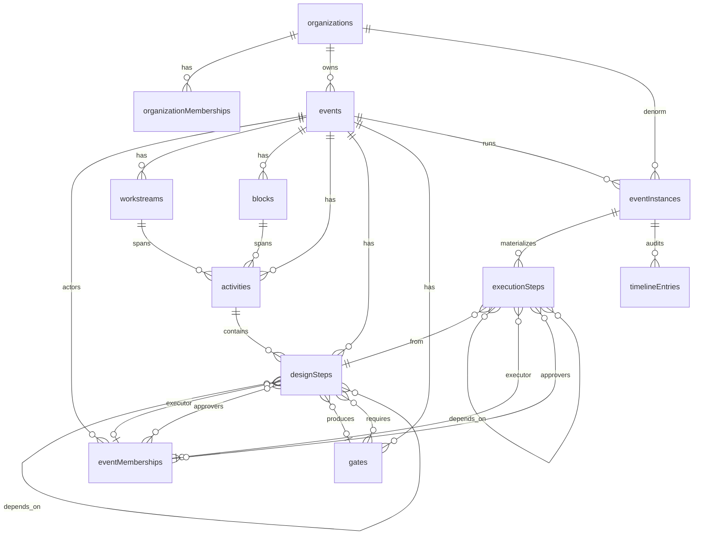

# Diseño de base de datos — ControlX

**Versión:** 1.0 · **Fecha:** 2026-08-20  
**Motor:** MongoDB  
**DB default:** `controlx` (`MONGODB_URI` + `MONGODB_DB_NAME`)  
**Cliente:** `src/lib/mongodb.ts`  
**Companion:** [Arquitectura](./arquitectura-tecnica.md) · [Diseño técnico](./diseno-tecnico-detallado.md)

Este documento describe el **modelo de datos real** tal como lo escribe y lee el código. Ante divergencia, prevalece el código.

---

## 1. Principios del modelo

| Principio | Cómo se refleja |
|-----------|-----------------|
| **Tenant primero** | Todo cuelga de `organizations` |
| **Diseño ≠ ejecución** | `events` + colecciones de prep vs `eventInstances` + `executionSteps` |
| **Materialización** | Al crear una ejecución se **copian** pasos de diseño a runtime (snapshot) |
| **Embeds selectivos** | Readiness en evento; iteraciones/evidencias/comentarios en el paso; aprobaciones de gate en la instancia |
| **IDs ObjectId** | Referencias internas; identidad de usuario suele ser string Clerk / `dev:{email}` |
| **Blobs fuera** | Archivos de evidencia en Vercel Blob; en Mongo solo metadatos |

No hay migraciones automáticas ni `createIndex` en runtime. Los índices de `controlXIndexes` (`src/domain/controlx.ts`) están **declarados pero no aplicados por código** — conviene crearlos en Atlas/local a mano (ver §7).

---

## 2. Diagrama ER



### Mapa concepto → colección

| Concepto de producto | Colección |
|----------------------|-----------|
| Organización | `organizations` |
| OrgAdmin | `organizationMemberships` |
| Evento (plantilla) | `events` |
| Actor del mapa | `eventMemberships` |
| Workstream / Bloque / Actividad | `workstreams` / `blocks` / `activities` |
| Paso de diseño | `designSteps` |
| Gate | `gates` |
| Ejecución (simulacro/real) | `eventInstances` |
| Paso en corrida | `executionSteps` |
| Auditoría de actos | `timelineEntries` |
| Feedback / changelog / AI audit | `feedback` / `novedades` / `aiGuideAudits` |

---

## 3. Inventario de colecciones

### 3.1 `organizations`

Tenant raíz.

| Campo | Tipo | Notas |
|-------|------|--------|
| `_id` | ObjectId | |
| `name` | string | |
| `slug` | string | Unicidad por app |
| `description` | string | |
| `status` | `"ACTIVE"` \| `"ARCHIVED"` | |
| `createdBy` | string | |
| `createdAt` / `updatedAt` | Date | |

---

### 3.2 `organizationMemberships`

Admins de organización.

| Campo | Tipo | Notas |
|-------|------|--------|
| `_id` | ObjectId | |
| `organizationId` | ObjectId | → `organizations` |
| `email` | string | lowercase |
| `name` | string? | |
| `role` | `"ORG_ADMIN"` | fijo hoy |
| `status` | `"ACTIVE"` \| `"INACTIVE"` | soft-delete |
| `createdBy` / `createdAt` | string / Date | |
| `updatedBy` / `updatedAt` | string? / Date? | |
| `deactivatedBy` / `deactivatedAt` | string? / Date? | |

**Filtros frecuentes:** `{ organizationId, status }`, `{ email, status, role }`.

---

### 3.3 `events`

Diseño / plantilla del evento. **No** es la corrida en vivo.

| Campo | Tipo | Notas |
|-------|------|--------|
| `_id` | ObjectId | |
| `organizationId` | ObjectId | → `organizations` |
| `name` / `description` / `timezone` | string | |
| `dayDStartAt` | Date \| null | T0 de la REAL |
| `status` | `"BORRADOR"` \| `"ACTIVO"` \| `"ARCHIVED"` | |
| `statusBeforeArchive` | `"BORRADOR"` \| `"ACTIVO"`? | |
| `readiness` | objeto embebido? | checklist cacheado |
| `createdBy` / `createdAt` / `updatedAt` | | |

#### Embed: `readiness`

Snapshot de preparación (`event-readiness-store.ts`):

- `stale: boolean`
- `computedAt: Date | null`
- `canStart: boolean`
- `blockers: string[]`
- `summary`, `setup`, `design`, `roles`, `plan` — detalle de checks
- `aiAnalysis?` — reserva opcional

Al tocar prep se marca `stale: true`. Crear ejecución exige snapshot fresco + `canStart`.

---

### 3.4 `eventMemberships`

Mapa de actores del **evento** (no de la instancia).

| Campo | Tipo | Notas |
|-------|------|--------|
| `_id` | ObjectId | = actorId en UI/API |
| `eventId` | ObjectId | → `events` |
| `organizationId` | ObjectId | denormalizado |
| `email` | string | clave lógica con eventId |
| `name` / `area` | string? | |
| `roles` | `("EVENT_ADMIN"\|"EXECUTOR"\|"APPROVER"\|"STEERCO")[]`? | |
| `role` | `"EVENT_ADMIN"`? | **legacy** si no hay `roles` |
| `status` | `"ACTIVE"` \| `"INACTIVE"` | |
| `createdBy` / `createdAt` | | |
| `updated*` / `deactivated*` | opcionales | |

Referenciado por `executorActorId` / `approverActorIds` en diseño y runtime.

> **Deuda:** el Zod `eventMembershipSchema` en `domain/controlx.ts` habla de `eventInstanceId` + `clerkUserId` — **no** coincide con estos documentos.

---

### 3.5 `workstreams` · `blocks`

Misma forma; semántica distinta (línea de trabajo vs objeto transversal).

| Campo | Tipo |
|-------|------|
| `_id` | ObjectId |
| `eventId` | ObjectId → `events` |
| `name`, `description` | string |
| `order` | number |
| `createdBy` / `createdAt` / `updatedAt` | |

Unicidad lógica `{ eventId, name }` (validada en aplicación).

---

### 3.6 `activities`

Cruce workstream × bloque.

| Campo | Tipo |
|-------|------|
| `_id` | ObjectId |
| `eventId` | ObjectId |
| `workstreamId` | ObjectId → `workstreams` |
| `blockId` | ObjectId → `blocks` |
| `name`, `description` | string |
| `order` | number |
| `createdBy` / `createdAt` / `updatedAt` | |

---

### 3.7 `designSteps`

Pasos del plan (fuente al materializar).

| Campo | Tipo | Notas |
|-------|------|--------|
| `_id` | ObjectId | |
| `eventId` | ObjectId | |
| `workstreamId` / `blockId` / `activityId` | ObjectId | jerarquía |
| `name` / `description` | string | |
| `longDescription` | string? | |
| `evidenceRequired` | boolean? | default false |
| `order` | number | |
| `plannedStartAt` | Date \| null? | relativo al Día D en prep |
| `estimatedDurationMinutes` | number \| null? | |
| `dependencyStepIds` | ObjectId[]? | → otros `designSteps` |
| `approvalRoles` | ApprovalRole[]? | catálogo de roles |
| `executorActorId` | ObjectId \| null? | → `eventMemberships` |
| `approverActorIds` | ObjectId[]? | → `eventMemberships` |
| `producesGateId` | ObjectId \| null? | → `gates` |
| `requiresGateIds` | ObjectId[]? | → `gates` |
| `createdBy` / `createdAt` / `updatedAt` | | |

`ApprovalRole` ∈ `EVENT_ADMIN` \| `WORKSTREAM_ADMIN` \| `APPROVER` \| `STEERCO`.

---

### 3.8 `gates`

Compuertas del diseño. **No** se materializan a otra colección: en ejecución se proyectan desde aquí + `gateApprovals` de la instancia.

| Campo | Tipo | Notas |
|-------|------|--------|
| `_id` | ObjectId | |
| `eventId` | ObjectId | |
| `name` / `description` | string | |
| `order` | number | |
| `opensTargets` | `{ workstreamId, blockId\|null, stepId? }[]`? | ObjectIds |
| `closesAfterTargets` | mismo shape? | |
| `plannedOpenAt` | Date \| null? | |
| `approvalRoles` | ApprovalRole[]? | |
| `createdBy` / `createdAt` / `updatedAt` | | |

---

### 3.9 `eventInstances` (ejecuciones)

Nombre histórico de colección = **ejecución**.

| Campo | Tipo | Notas |
|-------|------|--------|
| `_id` | ObjectId | `executionId` en API |
| `eventId` | ObjectId → `events` | |
| `organizationId` | ObjectId | denormalizado |
| `name` | string | |
| `type` | `"SIMULACRO"` \| `"REAL"` | |
| `timezone` | string | |
| `anchorStartAt` | Date \| null? | **T0** de la instancia |
| `anchorDayKey` | string \| null? | `YYYY-MM-DD` |
| `iteration` | number? | # en el mismo día/tipo |
| `status` | ver abajo | estado de la **instancia** |
| `gateApprovals` | array? | embed de aprobaciones |
| `createdBy` / `createdAt` / `updatedAt` | | |

**Status de instancia:**  
`BORRADOR` · `PREPARADO` · `EN_EJECUCION` · `PAUSADO` · `FINALIZADO` · `CANCELADO`

#### Embed: `gateApprovals[]`

| Campo | Tipo |
|-------|------|
| `gateId` | ObjectId → `gates` |
| `role` | ApprovalRole |
| `actorId` / `actorLabel` | string |
| `approvedAt` | Date |

---

### 3.10 `executionSteps`

Snapshot runtime de cada paso. Colección real; **no** se llama `steps`.

| Campo | Tipo | Notas |
|-------|------|--------|
| `_id` | ObjectId | |
| `eventInstanceId` | ObjectId → `eventInstances` | |
| `eventId` | ObjectId | denormalizado |
| `designStepId` | ObjectId → `designSteps` | |
| `workstreamId` / `blockId` / `activityId` | ObjectId | |
| `workstreamName` / `blockName` / `activityName` | string | snapshot UI |
| `name` / `description` | string | |
| `longDescription` | string? | |
| `evidenceRequired` | boolean? | |
| `order` | number | |
| `plannedStartAt` | Date \| null | anclado al T0 |
| `estimatedDurationMinutes` | number \| null | |
| `dependencyStepIds` | ObjectId[] | → **otros `executionSteps`** (remap) |
| `executorActorId` | ObjectId \| null | → `eventMemberships` |
| `executorName` | string \| null | denormalizado |
| `approverActorIds` | ObjectId[] | |
| `status` | RuntimeStepStatus | ver §4 |
| `forced` | boolean | |
| `actualStartedAt` / `actualEndedAt` | Date \| null? | |
| `iterations` | StepIteration[]? | **embebidas** |
| `comments` | StepComment[] | |
| `evidence` | EvidenceMeta[] | solo metadatos |
| `createdAt` / `updatedAt` | Date | |

**No persistidos en el doc runtime** (se releen del diseño al armar detalle): `producesGateId`, `requiresGateIds`, `approvalRoles`.

#### Embed: `iterations[]`

```ts
{
  n: number
  status: "EN_CURSO" | "EXITOSA" | "FALLIDA" | "FORZADA_OK"
        | "PENDIENTE_APROBACION" | "RECHAZADA"
  start: { at, comment?, evidence, by: { id, label }, recordedAt }
  end?:  { …, outcome: "success" | "fail" | "force" }
}
```

#### Embed: `evidence[]` (metadatos)

`url`, `pathname`, `contentType`, `size`, `uploadedBy`, `uploadedAt`, `caption?`  
Archivo físico: Vercel Blob bajo `evidences/{executionId}/{stepId}/…`.

#### Embed: `comments[]`

`id`, `text`, `authorId`, `authorLabel`, `createdAt`, `occurredAt?`, `kind` (`note` \| `start` \| `success` \| …).

---

### 3.11 `timelineEntries`

Auditoría append-only de actos.

| Campo | Tipo | Notas |
|-------|------|--------|
| `_id` | ObjectId | implícito |
| `eventInstanceId` | ObjectId | |
| `occurredAt` | Date | |
| `actorClerkUserId` | string | a veces `"system"` |
| `action` | string | p.ej. `STEP_START`, `GATE_APPROVED` |
| `entityType` | string | `execution` \| `step` \| `gate` |
| `entityId` | string | |
| `description` | string | |
| `previousState` / `nextState` | object? | en transiciones |

---

### 3.12 `feedback`

Sin FK a org/evento.

| Campo | Tipo |
|-------|------|
| `_id` | ObjectId |
| `message` | string |
| `status` / `statusNote` / `statusChangedAt` | opcionales |
| `authorEmail` / `authorId` | string |
| `createdAt` / `updatedAt?` | Date |

---

### 3.13 `novedades`

Changelog del producto (distinto del filtro “novedad” del Mapa).

| Campo | Tipo |
|-------|------|
| `_id` | ObjectId |
| `seedKey` | string? | idempotencia |
| `title` / `changes` | string |
| `icon` | enum UI |
| `publishedAt` | Date |
| `createdBy` / `createdAt` / `updatedAt?` | |

---

### 3.14 `aiGuideAudits`

| Campo | Tipo | Notas |
|-------|------|--------|
| `_id` | ObjectId | |
| `status` | enum audit | |
| `userId` / `userEmail` | string | |
| `organizationId` / `eventId` | string \| null | **string**, no ObjectId |
| `zone` | GuideZone | |
| `userMessage` / `assistantPreview` | string / string? | |
| `toolNames` / `finishReason` / tokens / `blockedReason` / `model` | | |
| `createdAt` | Date | rate-limit por `userId` + ventana |

---

### 3.15 `phases` (legacy)

Solo aparece en `deleteMany` al borrar organización. **Sin create/read/update** activos. Colección zombie — no usar en features nuevas.

---

## 4. Enumeraciones de estado (persistidas)

### Paso runtime (`executionSteps.status`)

`PLANIFICADO` · `INICIADO` · `PENDIENTE_APROBACION` · `EXITOSO` · `APROBADO` · `FALLIDO` · `RECHAZADO` · `OMITIDO` · `SIMULADO`

### Instancia (`eventInstances.status`)

`BORRADOR` · `PREPARADO` · `EN_EJECUCION` · `PAUSADO` · `FINALIZADO` · `CANCELADO`

### Evento diseño (`events.status`)

`BORRADOR` · `ACTIVO` · `ARCHIVED`

> No confundir los tres espacios de nombres: son independientes.

---

## 5. Relaciones y cardinalidad (resumen)

```text
organizations 1 ── * events
events        1 ── * eventMemberships | workstreams | blocks | activities | designSteps | gates | eventInstances
workstream × block ── * activities ── * designSteps
designSteps   * ── * designSteps          (dependencyStepIds)
designSteps   * ── 0..1 gates             (producesGateId)
designSteps   * ── * gates                (requiresGateIds)
eventInstances 1 ── * executionSteps
eventInstances 1 ── * timelineEntries
executionSteps * ── * executionSteps      (dependencyStepIds remapeados)
executionSteps * ── 1 designSteps         (designStepId)
```

**Gates en corrida:** no hay fila por gate-instancia. Evaluación = diseño + `eventInstances.gateApprovals` + estado de pasos productores.

---

## 6. Ciclo de vida y cascadas

### Crear ejecución

1. Validar readiness (`canStart`, no `stale`).  
2. Insert `eventInstances` (`PREPARADO`, T0 según tipo).  
3. `materializeExecutionSteps` → `insertMany` `executionSteps` + timeline.

### Delete execution

1. `executionSteps` + `timelineEntries` por `eventInstanceId`.  
2. Doc `eventInstances`.  
3. Blobs `evidences/{executionId}/…` (best-effort).  
4. Por defecto **bloquea** borrar `REAL` salvo flag `allowReal`.

### Purge simulacros

Todas las `eventInstances` con `type: "SIMULACRO"` del evento → delete execution. No toca REAL.

### Limpiar diseño (nuclear)

1. Borra **todas** las ejecuciones del evento (incluye REAL).  
2. `designSteps`, `activities`, `gates`.  
3. **Conserva** workstreams y blocks.  
4. Marca readiness `stale`.

### Delete event

Solo si `executionCount === 0`. Borra evento + actores + WS/bloques/actividades/pasos/gates.

### Delete organization

Cascada completa de eventos (incl. runtime + diseño + `phases` legacy + memberships). **No** limpia Blob ni `feedback` / `novedades` / `aiGuideAudits`.

---

## 7. Índices recomendados

### Declarados en dominio (aplicar en Atlas)

Ver `controlXIndexes` en `src/domain/controlx.ts` para orgs, events, workstreams, blocks, activities, designSteps, gates, eventInstances, timelineEntries.

**Corregir / complementar** respecto al código real:

| Colección | Índice sugerido | Motivo |
|-----------|-----------------|--------|
| `eventMemberships` | `{ eventId: 1, email: 1 }` unique | docs reales (no `clerkUserId`) |
| `eventMemberships` | `{ email: 1, status: 1 }` | lookup de acceso |
| `organizationMemberships` | `{ organizationId: 1, status: 1 }` | listado admins |
| `organizationMemberships` | `{ email: 1, status: 1, role: 1 }` | resolución OrgAdmin |
| `executionSteps` | `{ eventInstanceId: 1 }` | carga de detalle / poll |
| `executionSteps` | `{ eventInstanceId: 1, status: 1 }` | filtros |
| `executionSteps` | `{ eventInstanceId: 1, executorActorId: 1 }` | “mis pasos” |
| `eventInstances` | `{ eventId: 1, type: 1, anchorDayKey: 1 }` | numeración / listados |
| `aiGuideAudits` | `{ userId: 1, createdAt: -1 }` | rate-limit |
| `novedades` | `{ seedKey: 1 }` unique sparse | seeds |
| `feedback` | `{ createdAt: -1 }` | inbox |

**No crear** colección `steps` ni `iterations`: no existen en runtime.

---

## 8. Diagrama de storage (Mongo vs externo)

```text
┌──────────────── MongoDB (controlx) ────────────────┐
│  Tenant / prep / runtime / audit / producto         │
│  evidence[] = solo metadatos                        │
└──────────────────────────┬─────────────────────────┘
                           │ pathname
                           ▼
┌──────────────── Vercel Blob (privado) ─────────────┐
│  evidences/{executionId}/{stepId}/…                 │
│  Servido vía GET .../evidence/file (auth)           │
└────────────────────────────────────────────────────┘
```

Clerk no es “tabla” de ControlX: la identidad llega como string; SuperAdmin se resuelve por email env.

---

## 9. Deuda / trampas del modelo

| # | Tema | Impacto |
|---|------|---------|
| 1 | Índices dominio hablan de `steps` / `iterations` | Confusión; no crear esas colecciones |
| 2 | `eventMembershipSchema` Zod ≠ docs reales | No usar ese schema para persistencia |
| 3 | `phases` legacy | Solo cleanup de org |
| 4 | `WORKSTREAM_ADMIN` en gates/pasos, no en mapa Setup | Roles de aprobación vs actores |
| 5 | Gates no materializados | Cambios de diseño afectan evaluación de corridas abiertas vía join |
| 6 | AI audit IDs como string | Joins frágiles |
| 7 | Delete org no limpia Blob | Huérfanos posibles en storage |
| 8 | Unicidades por app | Race conditions sin índice unique real |

---

## 10. Ejemplo mínimo de grafo (una corrida)

```text
organizations/_id=Org1
  events/_id=Evt1  (dayDStartAt, readiness)
    eventMemberships/_id=ActAna (EXECUTOR), ActBob (APPROVER)
    workstreams/WS1 · blocks/Blk1 · activities/Act1
    designSteps/D1 → D2 (dependencyStepIds)
    gates/G1 (opensTargets → WS1)
    eventInstances/Ex1 (type=SIMULACRO, anchorStartAt=T0)
      executionSteps/S1 (designStepId=D1, status=APROBADO, iterations[…])
      executionSteps/S2 (designStepId=D2, dependencyStepIds=[S1], status=PLANIFICADO)
      timelineEntries[…]
```

---

## 11. Checklist al cambiar el esquema

- [ ] Actualizar tipos en `admin-data` / `execution-runtime` / `execution-types`  
- [ ] Revisar materialización y sync desde diseño  
- [ ] Cascadas: clear nuclear, delete event/org, purge  
- [ ] Índices Atlas  
- [ ] Este documento + diseño técnico  
- [ ] No introducir colección `iterations` suelta sin migración explícita  

---

*Documento alineado al código de ControlX (2026-08-20).*
